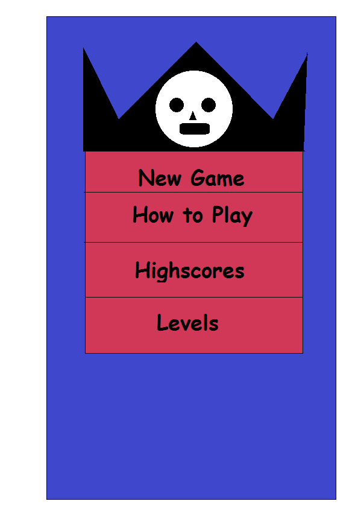
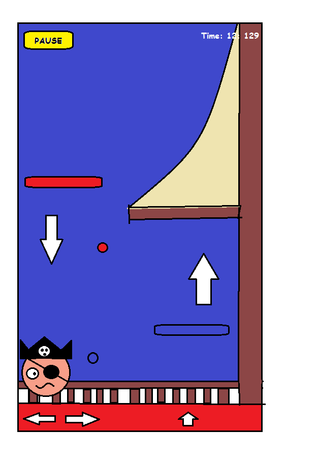
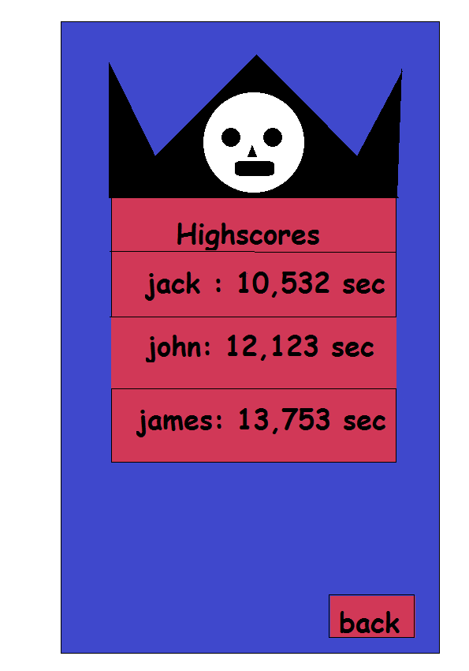
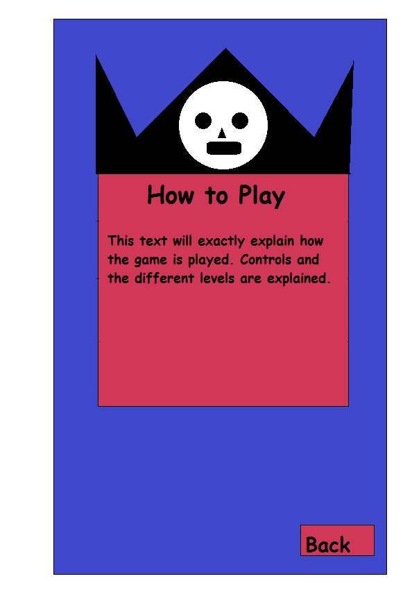

# Design Document

### MVP

  - Playing platform 2D game
  - Saving Highscores

#### UML

### Sketches

##### MenuScreen
In the main menu the player can choose to play a new game, which will open a new playscreen. Also he can check what highscores there have been made. In the future, multiple levels will be available. The player can choose which one he wants to play.

##### PlayScreen

##### HighscoreScreen

The highscores are in seconds. The lower the seconds, the better the score. 

##### HowToScreen

A Short explanation how the game is played.

#### API

The LibGXD libary is implemented into Android Studio to get game graphics and other usefull resources.

