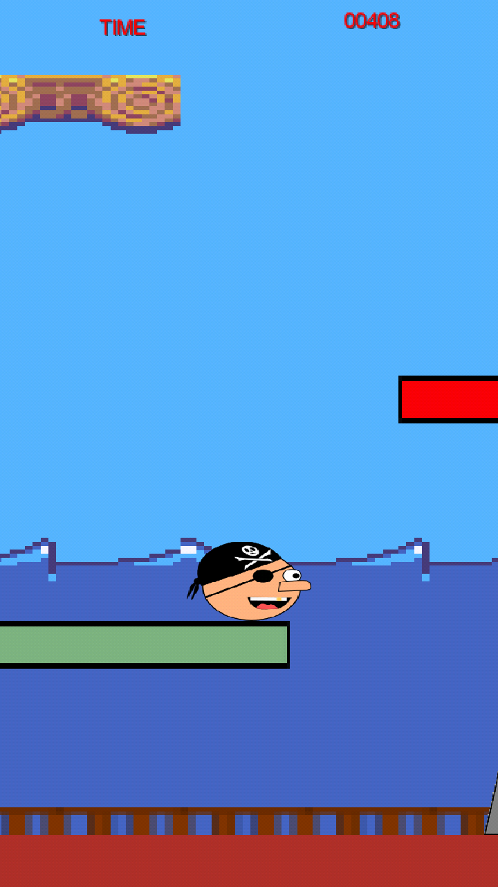
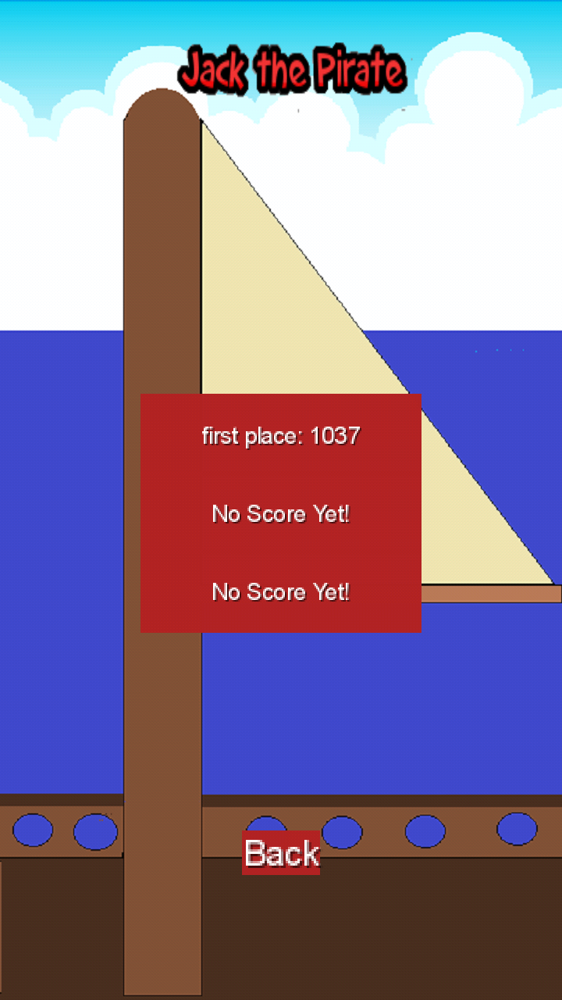
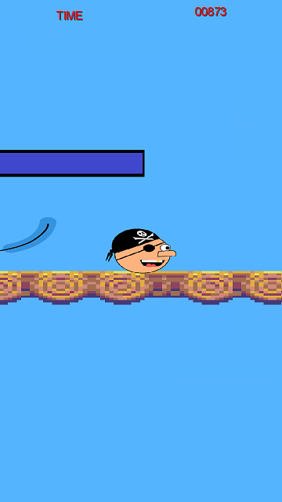
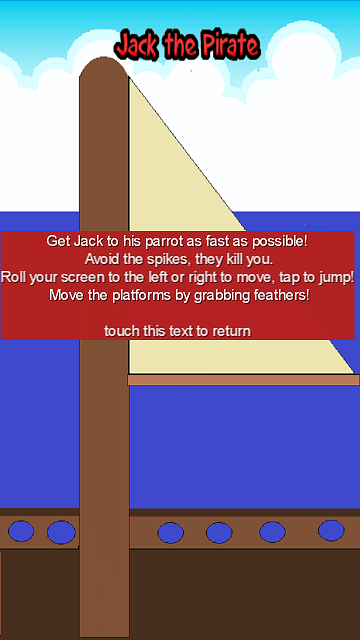

# Jack The Pirate

Lirry Pinter
10565051

Jack the Pirate is een 2D platformer voor Android waarin een piraat(hoofd) die zijn papagaai kwijt is. Het doel is dan ook om je papagaai te vinden. De speler moet met de accelerometer en door op het scherm te tikken Jack besturen. Pak de veren om de platformen met dezelfde kleuren te laten bewegen! Kijk uit voor de spikes, want dan is het game-over. Jack the Pirate is gemaakt met de LibGDX engine voor cross-platform gamedeveloping. 

 
  
. 

Externe bronnen:

- Kenney van http://kenney.nl/ (Game-art, (.tmx file))
- Brent Aureli https://www.youtube.com/user/Profyx (Game-engine, (PlayScreen))
- Gustavo Steigert http://steigert.blogspot.nl/2012/03/4-libgdx-tutorial-tablelayout.html (Menu lay-out, AbstractScreens)

