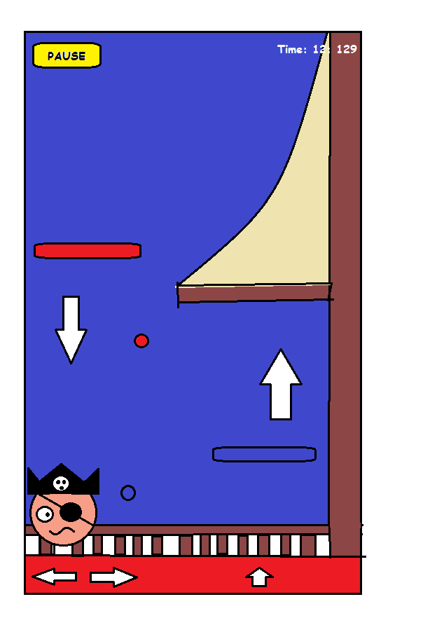

# Jack The Pirate

Lirry Pinter
10565051

- Met deze game kan de gebruiker zijn eeuwige honger naar tijdsverdrijf op een leuke manier invullen, en zich begeven in de wonderlijke wereld van piraten. 
In deze platformer (in 2D dus) ben je Jack the Pirate, een piraatje op je schip Tytanic. Zodra het level start, begint het schip met zinken. Aan jou om zo snel mogelijk naar boven te komen. Dit doe je door van mast naar mast te springen. De manier waarop dit gaat: een blauwe mast wordt pas geactiveerd als de piraat door het blauwe balletje springt. Dus vanaf dat moment kan Jack gebruik maken van deze mast. Zo moet de speler balletjes verzamelen om zo snel mogelijk omhoog te komen. Als de speler in het kraaiennest is is het level uitgespeeld.

-	Voor het maken van de sprites ga ik gebruikmaken van Inkscape of Adobe Illustrator. Voor andere data zie punt 5.
-	De game bestaat uit verschillende activities. In de main-activity kan er gekozen worden tussen levels,  highscores (in tijd), settings en exit. Voorlopig komen er vijf levels, als het lukt meer. 
-	Ik ga LibGDX gebruiken om de engine van deze game te maken. Dit is een open-source API die in Android Studio geimplementeerd kan worden.
-	Mijn grootste valkuil zal het maken van de sprites zijn. Ik wil gebruik maken van vector images. Omdat de design programmas hiervoor moeilijk onder de knie te krijgen zijn wordt dit een lastige zaak. 
-	Er zijn verschillende games met overeenkomsten. Doodlejump lijkt er erg veel op, alleen moet het beeldscherm bewogen worden en springt het mannetje constant. Het gevoel wat deze games de gemiddelde speler geven is voldoening. Dit is wat ik bij mijn game ook wil bereiken. 

