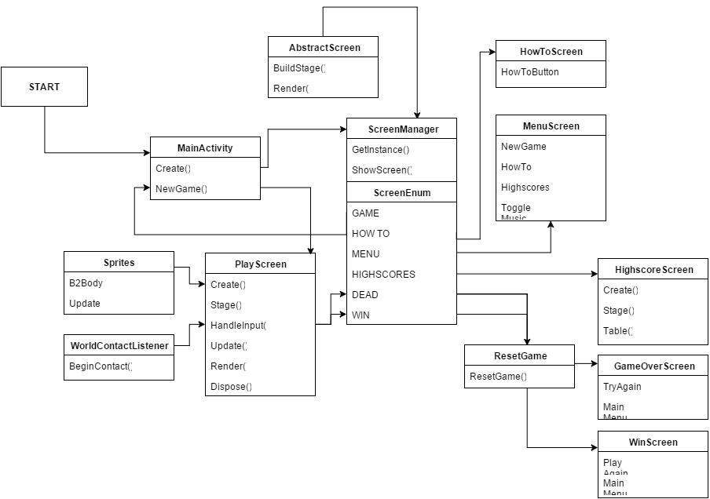

# Jack the Pirate

Jack the Pirate is een 2D platformer voor Android, gemaakt met de LibGDX engine.
De controls bestaan uit twee elementen. 
Ten eerste kan Jack naar links of rechts bewogen worden met de accelerometer.Door het scherm te kantelen gaat Jack in diezelfde richting. 
Daarnaast kan Jack springen, dit gebeurd als de speler op het scherm tikt. De speler moet veren zoeken. Elke veer staat in conectie met een platform. 
Als de groene veer gepakt wordt door de speler, gaat het groene platform bewegen. Als vervolgens de rode veer gepakt wordt gaat het rode platform bewegen, etc.
Wel is het zo dat als de speler bijvoorbeeld eerst de groene veer gepakt had en vervolgens de rode, dat de groene veer dan niet meer in het bezit is van de speler.
Op deze manier moet de speler tactisch de veren pakken, om te zorgen dat hij of zij op het goede moment naar het volgende platform kan springen. 

Het level is opgebouwd met behulp van Tiled Map Editor, waarmee er simpel een level 'gebouwd' kan worden door middel van tegels.
Deze tegels kun je zelf maken, maar bij deze game is er gebruik gemaakt van externe bronnen (credit naar Kenney op http://kenney.nl/, 
en Brent Aureli). 

De meeste schermen zijn opgebouwd met behulp van Scene2D. Dat is een implementatie van LibGDX waarmee op een simpele manier een stage gebouwd kan worden. Dit was handig
voor de menuschermen, maar niet voor de PlayScreen (waar het spel zich in afspeelt). De speler krijgt zijn laatste drie highscores te zien in het highscore scherm, dit werkt via SharedPreferences.

De Sprites zijn opgebouwd met behulp van Box2D. Via deze methode laat je de sprite eerst laden, stel je hoe groot hij is, en vervolgens ga je een lichaam creëren. 
Dit is een niet-zichtbaar object wat zich om de sprite heen begeeft. Deze kun je eigenschappen zoals zwaartekracht en positie meegeven. Ook kan er aangeven worden waar het object collisie mee kan hebben.
Vervolgens worden de twee 'bodies' tot één geheel getekend op het scherm. 

Ik heb verschillende methoden geprobeerd, van de UML die ik aan het begin gemaakt heb is niet veel meer hetzelfde. 

## UML

## Opbouw

- Binnen de LibGDX engine heb ik gekozen om via een ScreenManager van schermen te wisselen. Met behulp van de ScreenEnum class(Wat simpelweg verwijzingen zijn naar de Screens)
en een AbstractScreen class (standaard opbouw methode van een screen) kan ik makkelijk wisselen tussen schermen. Scene2D is een handige toevoeging waarin met behulp van "stages" het 
scherm opgebouwd kan worden.
- De PlayScreen class is waar het hele spel zich bevind. De map, sprites, physics, muziek en preferences worden ingeladen.
- De Sprites (dit zijn Jack zelf, de platforms, de veren en de papagaai) zijn gemaakt met behulp van de Box2D implementatie van LibGDX.

## Keuzes

Mijn originele plan was om net zoals Brent Aureli deed in zijn Youtube tutorials alles af te laten hangen van de TiledMapEditor. Dit heeft op het eerste gezicht veel voordelen.
Binnen de TiledMapEditor kun je namelijk heel makkelijk tekenen wat de achtergrond is, en wat objecten zijn waar iets mee gedaan moet worden.
Je kunt met lijnen aangeven wat voor objecten er zich in je map bevinden. Op die manier heb ik een getekende bal gemaakt die een veer moest voorstellen. 
Binnen de map heb ik er lijnen omheen getekend en vervolgens met de WorldContactListener class gekeken wanneer er contact werd gemaakt met het object. 

Het grootste probleem met deze methode is dat het voornamelijk lelijk is. De tegels in de map zijn 16x16, niet echt een resolutie waar duidelijk een veer 
in gerepresenteerd kan worden. Daarnaast liep ik tegen problemen aan met het implementeren van verschillende veren die met verschillende platforms moesten werken.
De platforms konden op visueel gebied ook niet bewegen, dat wil zeggen dat de eigenschappen (Box2D lichaam) wel bewogen, maar het plaatje zelf niet. Dit kwam ook door de gebrekige resolutie.

Daarom heb ik er voor gekozen om, net zoals Jack, alle veren en platformen zelf te ontwerpen. Deze heb ik als Sprites allemaal ingeladen en eigenschappen (zoals wat voor lichaam, zwaartekracht en posities) meegegeven. 
Dit ging uiteindelijk redelijk makkelijk.

Origineel was ook het plan dat ik een soort HUD zou maken met daarin een doorzichtige controller waarmee Jack bestuurt kon worden. Ik heb dit idee laten varen
omdat ik het een leuke toevoeging vond dat de speler met de accelerometer kan spelen. Dit voegt bovendien een nieuwe moeilijkheidsgraad aan het spel toe.

Ook wilde ik meerdere levels maken. Achteraf was dit teveel werk, omdat ik meer moeite had dan verwacht met het bouwen van de game-engine. Nu ik alles onder de knie heb ga ik
zeker meerder levels maken, en alles een visuele upgrade geven. 

Het grootste probleem wat ik had tijdens het maken van deze game was de camera. Het was het eerste probleem dat ik tegen ben gekomen. Ik wilde er voor zorgen dat op verschillende schermen
verschillende resoluties beschikbaar waren. Dit werkt in LibGDX op een totaal andere manier dan in de normale Java enviroment. Tenslotte heb ik er voor gekozen om
de resolutie van 720x1280 te nemen, zodat hij goed werkt op mijn test device. Op tablets gaat dit misschien nog een probleem vormen. 

*Lirry Pinter - 10565051 - lirry.pinter@gmail.com*
